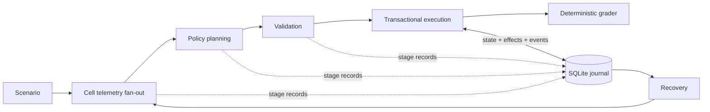

# intentd

**A recoverable Python workflow runtime with transactional execution and bounded concurrency.**

[](https://github.com/npang7/intentd-runtime/actions/workflows/ci.yml)

Multi-stage automation has to do more than produce a plan. It must persist progress,
execute configuration changes consistently, and recover when a process stops between
a database commit and the next line of application code. intentd implements that
execution boundary in Python, using asynchronous scheduling, typed contracts, and a
SQLite journal.

The application is simulated network operations: collect telemetry, prepare a policy,
review it, apply configuration actions, and check the resulting state. A deterministic
simulator makes execution and recovery reproducible. The same stage interface supports
offline model fixtures and an asynchronous Anthropic adapter.

## Engineering highlights

- **Transactional execution.** A configuration change, its effect record, and its
  journal event commit together. An interrupted transaction leaves all three unchanged.
- **Idempotent effects.** A logical action has a stable key covering the run, stage,
  step, tool, and arguments. Recovery reuses committed results instead of applying the
  same step twice.
- **Durable recovery.** Completed stages and applied actions are reconstructed from
  SQLite. A resumed process continues the unfinished work, including partially
  completed execution.
- **Bounded concurrency.** Independent cell analyses run asynchronously behind a
  semaphore. Results are merged in a stable order, with only the coordinator writing
  to the journal.
- **Explicit service boundaries.** Pydantic contracts check stage outputs and action
  parameters. Schema repairs and transport retries have separate budgets and records;
  model calls retain token usage, request IDs, and latency.

These mechanisms are exercised with real SQLite databases, deliberate write failures,
and subprocess termination. The [design notes](docs/design.md) explain the invariants
and the choices behind them.

## Run a deterministic demo

Use Python 3.11 or newer. From the repository root, create a virtual environment,
activate it, and install the project:

```sh
python -m venv .venv
```

On Windows, activate with `.venv\Scripts\Activate.ps1`; on macOS or Linux, use
`source .venv/bin/activate`. Then run:

```sh
python -m pip install -e ".[dev,real]"
python -m orchestrator.run --scenario coverage_hole_01 --model oracle:standard --db runs/demo.db --run-id demo
```

This is a **deterministic demo**: the fixture supplies a predefined configuration
sequence, while the runtime executes the stages, commits the effects, and grades the
state. It runs locally without an API key. The provider SDK is included because the
CLI also supports the live adapter.

The result includes these actions and verdict:

```json
{
  "action_log": [
    {"cell_id": "cell-1", "tool": "set_tx_power", "tx_power_dbm": 40.0},
    {"cell_id": "cell-1", "tilt_deg": 2.0, "tool": "set_tilt"}
  ],
  "grade": {"reasons": [], "success": true},
  "status": "finished"
}
```

The full output also contains the absolute journal path. Inspect its persisted
actions, then read the completed result through the recovery entry point:

```sh
python -m examples.inspect_journal --db runs/demo.db --run-id demo
python -m orchestrator.resume --db runs/demo.db --run-id demo
```

Use a fresh database or run ID when starting another run. Generated databases and
experiment outputs are ignored by Git.

## Watch crash recovery

```sh
python -m examples.recovery_demo
```

This example runs a clean reference, stops a second process immediately after its
first committed action, and resumes it. It verifies that the recovered state and
effect count match the reference. A second resume verifies that completion adds no
new effects. The example uses temporary databases and prints the checks it performs.

Example output:

```text
Scenario: coverage_hole_01 (deterministic demo)
Process exited after committed action: exit=137
Committed effects before recovery: 1
Recovered state matches reference: True
Effects after recovery: 2
Repeated resume added effects: 0
```

## Architecture



The coordinator owns persistence; model clients perform asynchronous service work;
tools own the simulator's configuration effects. Recovery loads recorded progress
and enters the same orchestration graph. This keeps normal execution and recovery
on one code path.

## Verification and further reading

```sh
python -m ruff check .
python -m ruff format --check .
python -m mypy
python -m pytest
python -m bench.chaos --n 150
```

CI runs these offline checks, including recovery from transaction-boundary crashes.
See the [testing guide](tests/README.md) for focused checks and the
[tooling guide](bench/README.md) for optional provider runs and usage analysis.
The [design notes](docs/design.md) cover storage, concurrency, and delivery semantics.

Source code is grouped into `orchestrator/` for scheduling and persistence, `sim/`
for network scenarios and grading, `bench/` for operational checks, and `examples/`
for the runnable walkthroughs. Network actions affect the simulator, not a live
network device. Live model calls are optional and require a process-environment
credential; the local demo and CI stay independent of that service.
